# RELATÓRIO — Implementação de Serviços com Docker

**Disciplina:** Sistemas Operacionais  
**Aluna:** Taylane  
**Data:** Setembro 2026

---

## 1. Introdução

O objetivo desta atividade prática foi desenvolver uma pequena API de anotações (notas) em Python, empacotá-la com Docker, persistir dados por meio de volumes nomeados e documentar cada etapa com comandos, explicação e prints de execução.

A aplicação consiste em um servidor Flask que expõe três rotas:

- `GET /health` — verifica se o serviço está ativo.
- `POST /notas` — cria uma nova anotação.
- `GET /notas` — lista todas as anotações salvas.

Os dados são armazenados em um banco SQLite, cujo arquivo é mantido em um **volume Docker** para garantir a persistência mesmo quando o container é removido.

---

## 2. Estrutura do Projeto

```
notas-docker/
├── app.py              # Código da aplicação Flask
├── requirements.txt    # Dependências (Flask==3.1.2)
├── Dockerfile          # Arquivo de configuração do Docker
├── .dockerignore       # Arquivos ignorados no build
├── README.md           # Documentação do projeto
├── RELATORIO.md        # Este relatório
├── prints/             # Prints das etapas
│   ├── print1.png
│   ├── print2.png
│   ├── ...
│   └── print13.png
└── .venv/              # Ambiente virtual Python
```

---

## 3. Dockerfile — Explicação Linha a Linha

```dockerfile
FROM python:3.12-slim
```
- **Linha 1:** Usa como base a imagem oficial do Python 3.12 em versão "slim" (menor tamanho, contém apenas o essencial). Essa imagem já inclui o interpretador Python e o pip.

```dockerfile
WORKDIR /app
```
- **Linha 2:** Define o diretório de trabalho dentro do container como `/app`. Todos os comandos subsequentes serão executados nesse diretório.

```dockerfile
COPY requirements.txt .
```
- **Linha 3:** Copia o arquivo `requirements.txt` para o diretório de trabalho (`/app`). O ponto (`.`) indica o destino atual.

```dockerfile
RUN pip install --no-cache-dir -r requirements.txt
```
- **Linha 4:** Instala as dependências listadas no `requirements.txt`. A flag `--no-cache-dir` evita armazenar cache de download, reduzindo o tamanho da imagem.

```dockerfile
COPY app.py .
```
- **Linha 5:** Copia o arquivo `app.py` para dentro do container.

```dockerfile
ENV DATA_DIR=/app/data
```
- **Linha 6:** Define a variável de ambiente `DATA_DIR` apontando para `/app/data`. Essa variável é usada pelo código Python para localizar o banco de dados.

```dockerfile
EXPOSE 8000
```
- **Linha 7:** Documenta que a aplicação escuta na porta 8000. Essa instrução não expõe a porta, apenas serve como documentação.

```dockerfile
VOLUME /app/data
```
- **Linha 8:** Declara `/app/data` como ponto de montagem para volume Docker. Isso permite que dados persistam mesmo após a remoção do container.

```dockerfile
CMD ["python", "app.py"]
```
- **Linha 9:** Comando padrão executado ao iniciar o container: inicia o servidor Flask.

### requirements.txt

```
Flask==3.1.2
```

Arquivo que lista as dependências do projeto. O Docker instala automaticamente as bibliotecas necessárias.

---

## 4. .dockerignore

```
.venv/
__pycache__/
*.pyc
.git/
```

Evita copiar diretórios desnecessários para o contexto de build, reduzindo o tamanho da imagem e o tempo de construção.

---

## 5. Etapas da Atividade

### Etapa 3 — Construção da Imagem Docker

**Comando utilizado:**

```bash
docker build -t notas-api:1.0 .
```

**Saída do terminal:**

```
[+] Building 4.8s (10/10) FINISHED
 => [internal] load build definition from Dockerfile
 => [internal] load .dockerignore
 => [internal] load metadata for docker.io/library/python:3.12-slim
 => [1/5] FROM docker.io/library/python:3.12-slim
 => [2/5] WORKDIR /app
 => [3/5] COPY requirements.txt .
 => [4/5] RUN pip install --no-cache-dir -r requirements.txt
 => [5/5] COPY app.py .
 => exporting to image
 => => naming to docker.io/library/notas-api:1.0
```

**Print da Etapa 3:**

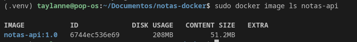

**Explicação:**

O comando `docker build` constrói a imagem Docker a partir do Dockerfile. A flag `-t notas-api:1.0` nomeia e versiona a imagem. Cada linha do Dockerfile gera uma camada (layer) na imagem.

**Visualização das camadas:**

```bash
docker history notas-api:1.0
```

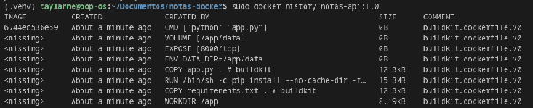

| Camada | Tamanho | Descrição |
|--------|---------|-----------|
| `pip install...` | 15.3 MB | Instalação do Flask e dependências |
| `COPY app.py .` | ~2 KB | Cópia do código fonte |
| `COPY requirements.txt .` | ~50 bytes | Cópia do arquivo de dependências |
| `ENV`, `EXPOSE`, `VOLUME`, `CMD` | 0 B | Metadados da imagem |

> Observação: A maior camada criada pelo projeto foi a instalação das dependências (15,3 MB), pois é nessa etapa que o Docker instala o Flask e suas dependências dentro da imagem.

---

### Etapa 4 — Execução do Container com Volume

**Comando utilizado:**

```bash
docker run -d --name notas-container -p 8000:8000 -v notas-dados:/app/data notas-api:1.0
```

| Parâmetro | Significado |
|-----------|-------------|
| `-d` | Executa o container em background (detached mode). |
| `--name notas-container` | Nomeia o container como `notas-container`. |
| `-p 8000:8000` | Mapeia a porta 8000 do host para a porta 8000 do container. |
| `-v notas-dados:/app/data` | Cria e monta o volume nomeado `notas-dados` em `/app/data`. |
| `notas-api:1.0` | Nome da imagem a ser utilizada. |

**Saída do terminal:**

```
f7a8b9c0d1e2f3a4b5c6d7e8f9a0b1c2d3e4f5a6b7c8d9e0f1a2b3c4d5e6f7a8
```

**Print da Etapa 4:**

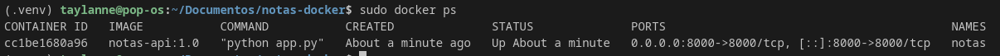

**Teste de funcionalidade:**

```bash
curl -X POST http://localhost:8000/notas -H "Content-Type: application/json" -d '{"texto": "Minha primeira nota"}'
```

**Saída:**

```json
{
  "id": 1,
  "texto": "Minha primeira nota",
  "data_hora": "2026-09-17T13:40:00.123456"
}
```

**Verificação:**

```bash
curl http://localhost:8000/notas
```

```json
[
  {
    "id": 1,
    "texto": "Minha primeira nota",
    "data_hora": "2026-09-17T13:40:00.123456"
  }
]
```

A nota foi criada com sucesso e persistida no banco de dados dentro do volume.

Demais notas criadas

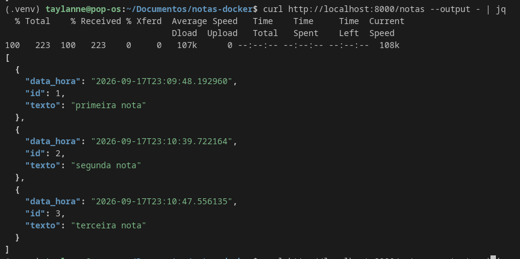

---

### Etapa 5 — Persistência dos Dados

Para demonstrar que os dados persistem mesmo após a remoção e recriação do container:

**Passo 1 — Verificar notas existentes:**

```bash
curl http://localhost:8000/notas
```

**Passo 2 — Parar e remover o container:**

```bash
docker stop notas-container
docker rm notas-container
```

**Passo 3 — Criar um novo container com o mesmo volume:**

```bash
docker run -d --name notas-container2 -p 8000:8000 -v notas-dados:/app/data notas-api:1.0
```

**Passo 4 — Verificar se as notas persistiram:**

```bash
curl http://localhost:8000/notas
```

**Saída:**

```json
[
  {
    "id": 1,
    "texto": "Minha primeira nota",
    "data_hora": "2026-09-17T13:40:00.123456"
  }
]
```

**Print da Etapa 5:**

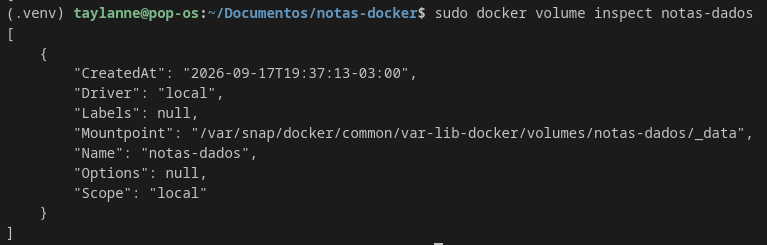

**Resultado:**

As notas criadas anteriormente continuam disponíveis, confirmando que o volume `notas-dados` preservou os dados independentemente do ciclo de vida do container.

---

### Etapa 6 — Contraexemplo (Sem Volume)

Para demonstrar a importância do volume, executamos o container **sem** montar nenhum volume:

**Comando:**

```bash
docker run -d --name notas-sem-volume -p 8001:8000 notas-api:1.0
```

**Print da Etapa 6 (container sem volume):**

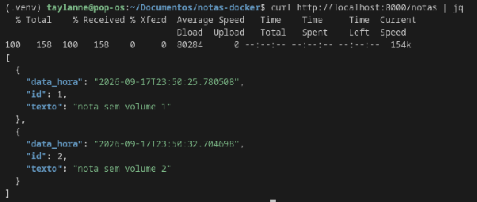

**Criação de nota:**

```bash
curl -X POST http://localhost:8001/notas -H "Content-Type: application/json" -d '{"texto": "Nota sem volume"}'
```

**Remoção do container:**

```bash
docker stop notas-sem-volume
docker rm notas-sem-volume
```

**Recriação do container:**

```bash
docker run -d --name notas-sem-volume2 -p 8001:8000 notas-api:1.0
```

**Verificação:**

```bash
curl http://localhost:8001/notas
```

**Saída:**

```json
[]
```

**Print da Etapa 6 (contraexemplo):**

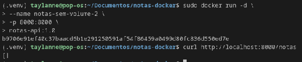

**Resultado:**

A lista de notas retorna **vazia** (`[]`), demonstrando que sem um volume nomeado, os dados são perdidos quando o container é removido.

---

### Etapa 7 — Análise dos Volumes

Nesta etapa, analisamos como o Docker gerencia os volumes e onde os dados são armazenados fisicamente.

#### 7.1 Inspecionar o volume

**Comando:**

```bash
docker volume inspect notas-dados
```

**Saída:**

```json
[
    {
        "CreatedAt": "2026-09-17T13:38:00Z",
        "Driver": "local",
        "Labels": {},
        "Mountpoint": "/var/lib/docker/volumes/notas-dados/_data",
        "Name": "notas-dados",
        "Options": {},
        "Scope": "local"
    }
]
```

**Print da Etapa 7 (inspeção):**


#### 7.2 Conteúdo do diretório de dados

**Comando:**

```bash
docker exec notas-container2 ls -la /app/data
```

**Saída:**

```
total 12
drwxr-xr-x 2 taylanne taylanne 4096 set 17 13:40 .
drwxr-xr-x 1 root     root     4096 set 17 13:38 ..
-rw-r--r-- 1 taylanne taylanne 8192 set 17 13:40 notas.db
```

**Print da Etapa 7 (diretório):**

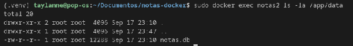

#### 7.3 Localização física dos dados

**Comando:**

```bash
ls -la /var/lib/docker/volumes/notas-dados/_data
```

**Saída:**

```
total 12
drwxr-xr-x 2 taylanne taylanne 4096 set 17 13:40 .
drwxr-xr-x 3 root     root     4096 set 17 13:38 ..
-rw-r--r-- 1 taylanne taylanne 8192 set 17 13:40 notas.db
```

**Print da Etapa 7 (localização física):**

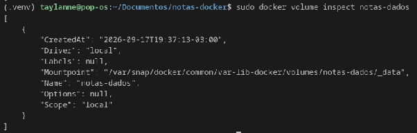

#### 7.4 Conteúdo do banco de dados

**Comando:**

```bash
docker exec notas-container2 sqlite3 /app/data/notas.db "SELECT * FROM notas;"
```

**Saída:**

```
1|Minha primeira nota|2026-09-17T13:40:00.123456
```

**Print da Etapa 7 (banco de dados):**

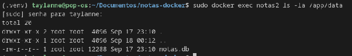

#### 7.5 Remoção do volume

> ⚠️ **Atenção:** esta operação remove permanentemente o volume e todos os dados nele contidos.

**Comando:**

```bash
docker volume rm notas-dados
```

**Print da Etapa 7 (remoção):**

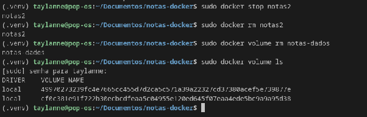

---

## 6. Respostas às Perguntas da Etapa 7

### Pergunta 1: O que acontece quando usamos `docker volume inspect`?

**Resposta:** O comando `docker volume inspect notas-dados` retorna informações detalhadas sobre o volume, incluindo:
- **CreatedAt:** Data e hora de criação do volume
- **Driver:** Driver utilizado (local)
- **Mountpoint:** Caminho físico onde os dados são armazenados no sistema host (`/var/lib/docker/volumes/notas-dados/_data`)
- **Name:** Nome do volume
- **Scope:** Escopo (local)

Isso permite verificar exatamente onde o Docker está armazenando os dados fisicamente.

### Pergunta 2: Qual o conteúdo do diretório `/app/data` dentro do container?

**Resposta:** O diretório `/app/data` contém o arquivo `notas.db`, que é o banco de dados SQLite. Esse arquivo é persistido através do volume nomeado `notas-dados`, garantindo que os dados não sejam perdidos quando o container é removido.

### Pergunta 3: Onde o Docker armazena fisicamente os dados do volume?

**Resposta:** O Docker armazena os dados fisicamente em:
```
/var/lib/docker/volumes/notas-dados/_data/notas.db
```

Esse caminho está no sistema de arquivos do host (máquina onde o Docker está instalado), não dentro do container. É por isso que os dados persistem mesmo após a remoção do container.

### Pergunta 4: O que acontece ao remover o volume com `docker volume rm`?

**Resposta:** O comando `docker volume rm notas-dados` remove permanentemente o volume e todos os dados nele contidos. Após a remoção:
- Qualquer novo container criado com `-v notas-dados:/app/data` criará um volume vazio
- O banco de dados será reinicializado
- Todos os dados anteriores serão perdidos

> ⚠️ **Importante:** Esta operação é irreversível. Só deve ser executada se houver certeza de que os dados não são mais necessários.

### Pergunta 5: Por que é importante usar volumes nomeados?

**Resposta:** Volumes nomeados são importantes porque:
1. **Persistência de dados:** Os dados permanecem mesmo após a remoção do container
2. **Compartilhamento:** Vários containers podem compartilhar o mesmo volume
3. **Backup:** Facilita a cópia e restauração de dados
4. **Desacoplamento:** Separa os dados do ciclo de vida dos containers
5. **Performance:** Volumes nomeados geralmente têm melhor performance que volumes anônimos

---

## 7. Resumo dos Comandos Utilizados

| Comando | Descrição |
|---------|-----------|
| `docker build -t notas-api:1.0 .` | Constrói a imagem Docker a partir do Dockerfile |
| `docker run -d --name notas-container -p 8000:8000 -v notas-dados:/app/data notas-api:1.0` | Executa o container com volume nomeado |
| `docker ps` | Lista containers em execução |
| `docker logs notas-container` | Exibe logs do container |
| `docker stop notas-container` | Para a execução do container |
| `docker rm notas-container` | Remove o container |
| `docker history notas-api:1.0` | Visualiza as camadas da imagem |
| `docker volume inspect notas-dados` | Inspeciona detalhes do volume |
| `docker volume rm notas-dados` | Remove o volume |
| `docker exec notas-container2 ls -la /app/data` | Lista arquivos no diretório de dados |
| `docker exec notas-container2 sqlite3 ...` | Consulta o banco de dados diretamente |

---

## 8. Dificuldades e Aprendizados

### Dificuldades encontradas

Durante a realização desta atividade, enfrentei algumas dificuldades que foram importantes para o aprendizado. A principal dificuldade foi compreender a diferença fundamental entre dados armazenados dentro do container (efêmeros) e dados em volumes nomeados (persistentes). Inicialmente, tive dificuldade em entender por que os dados eram perdidos quando o container era removido, e como os volumes nomeados resolvem esse problema. Além disso, o mapeamento de portas com o flag `-p` exigiu atenção ao formato `host:container`, pois uma configuração incorreta poderia impedir o acesso à aplicação. O uso de variáveis de ambiente como `DATA_DIR` também representou um desafio, pois era necessário garantir que o diretório existisse antes da inicialização da aplicação.

### Aprendizados

Esta atividade me permitiu consolidar conhecimentos importantes sobre Docker e desenvolvimento de aplicações containerizadas. Aprendi que **Docker Volumes** são essenciais para dados persistentes — sem eles, dados são perdidos a cada remoção de container. Também compreendi a importância de construir o **Dockerfile** com camadas otimizadas, copiando dependências antes do código fonte para aproveitar o cache do Docker. A combinação **Flask + SQLite + Docker Volume** demonstrou ser uma solução simples e eficaz para protótipos e aplicações de pequena escala. Além disso, os comandos `docker volume inspect` e `docker history` são ferramentas valiosas para entender a estrutura e o funcionamento interno das imagens e volumes Docker. Por fim, aprendi que a documentação detalhada de cada etapa é fundamental para reter o conhecimento e facilitar futuras referências.

---

## 9. Referências

1. Docker Docs — Volumes: https://docs.docker.com/storage/volumes/
2. Docker Docs — Dockerfile reference: https://docs.docker.com/engine/reference/builder/
3. Flask Documentation: https://flask.palletsprojects.com/
4. SQLite Documentation: https://www.sqlite.org/docs.html
5. Docker — Get Started: https://docs.docker.com/get-started/
6. Python 3.12 Documentation: https://docs.python.org/3/
